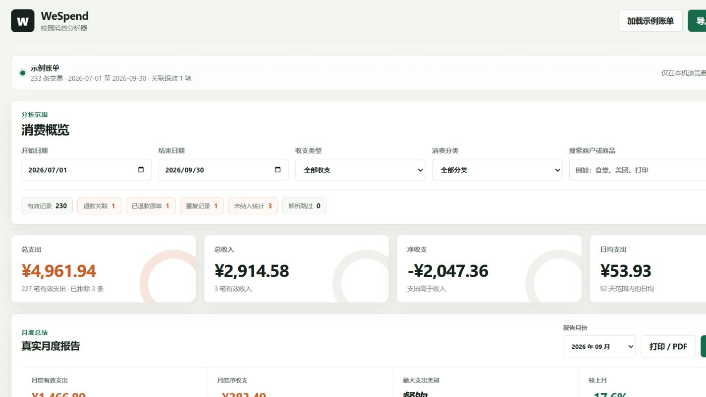

# WeSpend - 校园消费分析器

WeSpend 是一个本地优先的大学消费记录分析工具。它可以读取微信支付官方导出的账单 CSV、TXT 或文字型 PDF，在浏览器中完成清洗、分类、退款关联、统计和可视化，不需要上传账单，也不需要登录微信账号。



## 已实现

- 导入微信官方账单 CSV、TXT 和文字型 PDF
- CSV 支持 UTF-8 和 GB18030 编码
- PDF 通过本地 PDF.js 提取文字和坐标，不上传文件
- 支持一笔交易在 PDF 中跨 2 到 3 行排版，并合并时间、支付方式和商户续行
- 自动识别交易时间、交易对方、商品、收支、金额、支付方式和状态
- 根据关键词自动归类，并允许在明细表中逐笔修正
- 自动检测重复交易、无效状态和退款原记录
- 清洗摘要支持点击跳转并筛选交易明细
- 自动将退款入账与原消费按金额、商户和时间范围关联
- 退款原单和关联退款会标记为已退款，并避免重复计入有效支出
- 支出、收入、净收支和日均支出统计
- 支出趋势、分类占比、星期与时段热力图
- 月度预算和超支提示
- 按月份生成真实报告，与上月比较并给出自动结论
- 导出隐藏商户、日期和金额的匿名 HTML 月报
- 匿名报告可以通过浏览器打印为 PDF
- 高频商户与自动账单洞察
- 日期、收支类型、分类和关键词筛选
- 导出当前筛选结果 CSV
- 内置一批校园示例账单
- 桌面端和移动端响应式布局

## 运行

项目没有后端服务或在线运行时依赖，直接双击 `index.html` 即可使用。

PDF 导入建议通过本地预览服务器运行，以避开部分浏览器对本地 Worker 文件的限制：

```powershell
npm start
```

然后打开 `http://127.0.0.1:4173`。

## 数据来源

本工具只分析用户主动导出的账单文件。建议从微信中的“账单”页面选择“下载账单”，申请用于个人对账的账单文件，解压后导入其中的 CSV。

如果只获得文字型 PDF，也可以直接导入。图片扫描型 PDF 需要先经过 OCR，当前版本不会自动识别图片文字。

项目不会：

- 请求微信账号或密码
- 自动登录微信
- 抓取聊天记录
- 读取微信本地数据库
- 上传或保存用户的原始账单

## 处理规则

- 默认只保留交易成功、已入账等有效交易。
- 已撤销、已取消、交易关闭和支付失败记录会被跳过。
- 已退款原单会保留并显示“已退款”，但不会进入有效支出统计。
- 退款入账会优先匹配金额一致、商户相近且在合理时间范围内的原消费。
- 即使收入类型没有写“退款”，只要金额完全相同且商户相近或发生时间很近，也会尝试匹配并标记为“疑似退款”。
- 找到原消费后，两条记录都会显示关联状态，并避免重复影响月度统计。
- 无法匹配原消费的退款仍然保留为退款入账，并标记为“未找到原消费”。
- 完全相同的时间、商户、商品、收支和金额会识别为重复记录，只保留一条进入统计。
- 支出记为负数，收入记为正数；净收支为收入减去支出。
- 自动分类只是辅助，明细表中的手动分类会覆盖自动分类。
- 微信账单格式可能随版本变化，如果字段识别失败，需要根据真实导出的表头调整 `HEADER_ALIASES`。

## 分类实现

分类逻辑位于 `app.js` 的 `CATEGORY_KEYWORDS` 和 `findCategoryMatch`：

1. 把交易对方、商品说明和交易类型合并成一段文本。
2. 按“人情转账、餐饮、交通、学习、娱乐、数码、生活、购物”的顺序检查关键词。
3. 命中第一个关键词后返回对应分类，并记录分类依据。
4. 没有命中时归入“其他”。
5. 用户在明细表中选择新分类后，会记录为手动分类。

例如“荔园食堂”命中“食堂”后归为餐饮，“深圳地铁”命中“地铁”后归为交通，“校园打印店”命中“打印”后归为学习。

## 当前限制

- 不支持直接读取加密 ZIP 或 XLSX，仍然需要用户先解压。
- PDF 必须包含可复制文字；纯截图或扫描 PDF 需要 OCR。
- 当前 PDF 表格解析适配横排账单和跨行单元格，特殊模板仍可能需要进一步调整。
- 分类规则以内置关键词为主，不能识别所有自定义商户名称。
- 退款、转账、红包和亲属卡在不同账单版本中的含义可能不同，正式统计前应核对原始记录。
- 所有数据只保存在当前浏览器页面中，刷新后会恢复示例数据。
- 预算保存在 `localStorage`，其他筛选和分类修正不会持久化。

## 项目结构

```text
wechat-spending-analyzer/
├── index.html
├── styles.css
├── app.js
├── server.js
├── package.json
├── screenshot.png
├── vendors/
│   └── pdfjs/
│       ├── LICENSE
│       ├── pdf.min.js
│       └── pdf.worker.min.js
└── README.md
```

## 后续方向

- 支持直接在浏览器中导入加密账单 ZIP
- 增加用户自定义分类规则和规则导入导出
- 使用 IndexedDB 持久化分析结果
- 增加匿名报告直接导出 PDF，而不是先导出 HTML 再打印
- 加入固定支出识别和异常消费提醒
- 支持多账单合并与更复杂的重复交易检测

## 第三方组件

PDF 解析使用 Mozilla PDF.js `3.11.174`，文件位于 `vendors/pdfjs`。版权和许可证见 `vendors/pdfjs/LICENSE`。

## 许可与声明

WeSpend 与腾讯或微信没有关联，不包含微信官方代码、图标或数据接口。项目仅用于个人学习和本地账单分析。

提交为开源项目时，建议使用 MIT License，并在仓库中保留所有第三方资料的来源说明。
